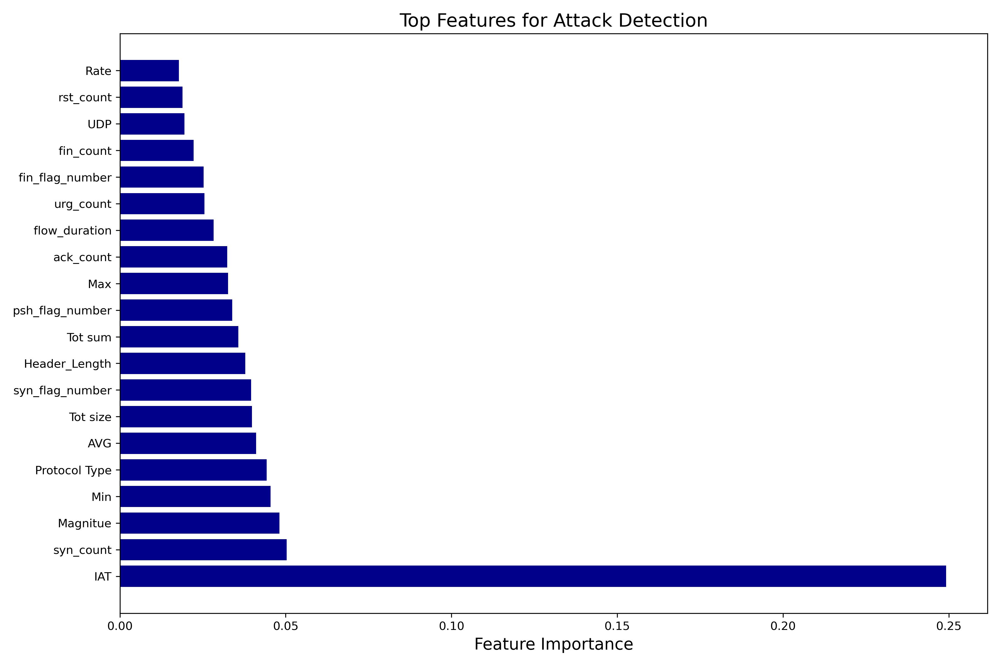
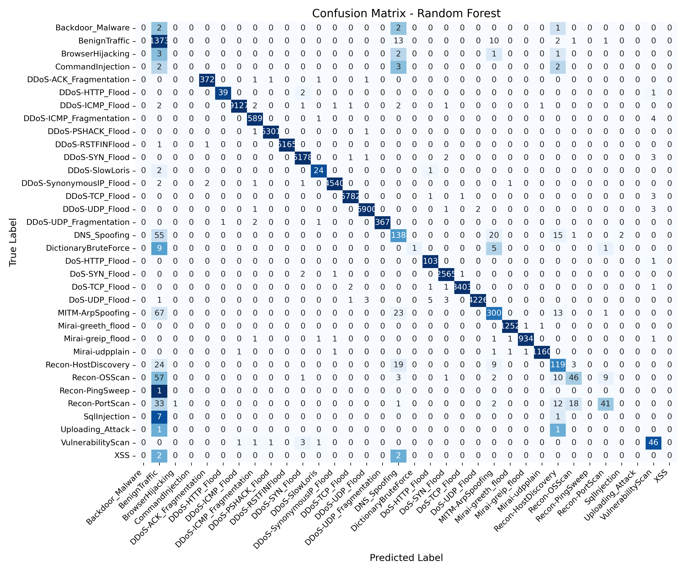
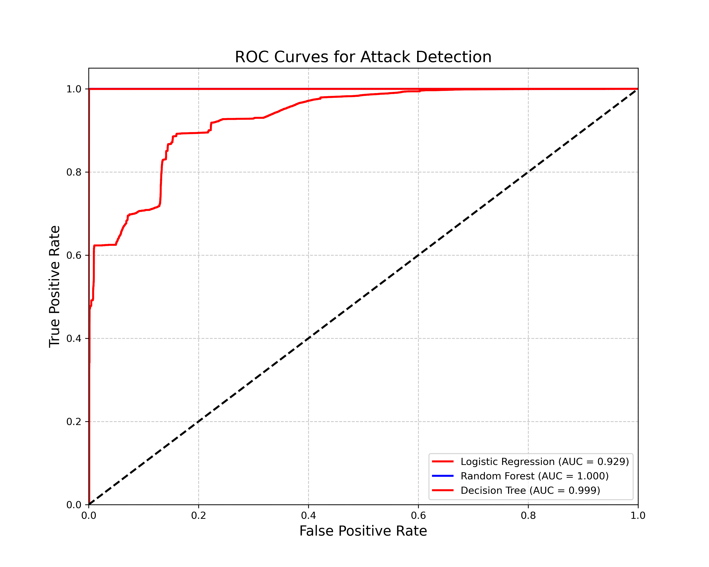

# SmartGuard: AI-Driven Security for Smart Homes

SmartGuard is an intelligent intrusion detection system designed to protect smart home networks from various cyber threats. Using machine learning techniques, SmartGuard analyzes network traffic to identify malicious activities such as DDoS, MITM, and other attacks.

## Overview

Smart home ecosystems are increasingly vulnerable to cyber attacks as more IoT devices connect to home networks. Traditional security solutions often fail to adapt to evolving threats, leaving smart homes at risk. SmartGuard addresses this challenge by implementing a machine learning-based approach that can detect multiple types of network attacks with high accuracy.

### Key Features

- **Multi-class attack detection**: Identifies various attack types including DDoS, DoS, MITM, reconnaissance, and more
- **High accuracy classification**: Uses Random Forest and Decision Tree algorithms to achieve high detection rates
- **Feature importance analysis**: Identifies the most relevant network characteristics for attack detection
- **Comprehensive visualization**: Provides intuitive visualizations of detection results and model performance
- **Real-time simulation**: Includes a demo script for real-time attack detection simulation
- **Modular architecture**: Well-structured codebase for easy maintenance and extension

## Project Structure

```
smartguard/
├── main.py                 # Main script to run the pipeline
├── demo_script.py          # Script for demonstrating real-time detection
├── modules/
│   ├── __init__.py         # Package initialization
│   ├── data_processor.py   # Data loading and preprocessing
│   ├── model_trainer.py    # Model training and hyperparameter tuning
│   ├── model_evaluator.py  # Performance evaluation and reporting
│   ├── visualizer.py       # Visualization tools
│   └── utils.py            # Utility functions and data simulation
├── data/                   # Directory for datasets
│   └── CIC-IoT 2023/       # CIC-IoT 2023 dataset
├── output/                 # Output directory for models and results
    ├── models/             # Trained model files
    ├── figures/            # Visualization outputs
    ├── reports/            # Performance reports
    └── demo/               # Demo outputs
```

## Requirements

- Python 3.7+
- NumPy
- Pandas
- Scikit-learn
- Matplotlib
- Seaborn
- Joblib

Install the required packages:

```bash
pip install numpy pandas scikit-learn matplotlib seaborn joblib
```

## Usage

### Binary Classification (DDoS Detection)

Run the main script for binary classification to detect DDoS attacks:

```bash
python main.py --data_path "data/CIC-IoT 2023/cic_subset.csv" --output_dir output
```

When prompted, enter the attack types to consider as DDoS (comma-separated).

### Multi-Class Attack Detection

For detecting multiple attack types:

```bash
python main.py --data_path "data/CIC-IoT 2023/cic_subset.csv" --output_dir output --multi_class
```

### Using Simulated Data

If you don't have access to real-world data or want to test the system with synthetic data:

```bash
python main.py --data_path dummy --output_dir output --simulate_data --multi_class
```

### Demonstration

Run the demo script to see the system in action with a pre-trained model:

```bash
python demo_script.py --model_path output/models/random_forest.pkl --output_dir output/demo
```

For multi-class attack demonstration:

```bash
python demo_script.py --model_path output/models/random_forest.pkl --output_dir output/demo --multi_class
```

## Output Examples

### Feature Importance



The feature importance chart shows which network characteristics are most relevant for attack detection. Features like RST count, packet count, and flow duration are typically among the most important indicators.

### Confusion Matrix



The confusion matrix visualizes the model's classification performance, showing true positives, false positives, true negatives, and false negatives.

### ROC Curve



ROC curves illustrate the trade-off between true positive rate and false positive rate at various threshold settings.

### Multi-class Performance


For multi-class detection, this chart shows the model's performance for each attack type.

## Methodology

SmartGuard employs a pipeline approach to network traffic analysis:

1. **Data Processing**: Load network traffic data and extract relevant features
2. **Model Training**: Train Random Forest and Decision Tree models using labeled data
3. **Evaluation**: Calculate performance metrics and generate confusion matrices
4. **Visualization**: Create visual representations of model performance and results

The models analyze over 40 network traffic features to identify patterns indicative of various attacks.

## Dataset

SmartGuard was developed and tested using the CIC-IoT 2023 dataset, which contains labeled network traffic data with various attack types. The dataset includes:

- Normal traffic
- DDoS attacks (various types)
- DoS attacks
- MITM attacks
- Reconnaissance attacks
- Botnet traffic
- And more

## Performance

In tests with the CIC-IoT 2023 dataset, SmartGuard achieves:

- Accuracy: >99%
- Precision: >99%
- Recall: >99%
- F1 Score: >99%

These metrics demonstrate the system's high reliability in detecting network attacks.

## Future Work

Potential extensions to SmartGuard include:

- Integration of reinforcement learning for adaptive defense
- Real-time deployment on home routers or gateways
- Anomaly detection for identifying unknown attack patterns
- API development for integration with other security tools
- Edge computing optimization for resource-constrained devices

## Authors

- Zihao Liu – B00868206
- Simon Schumph – B00890845

## Acknowledgements

- This project was developed for CSCI 4179/6711 - Intelligent Wireless Networks and Systems course
- We acknowledge the CIC-IoT 2023 dataset creators for providing valuable training data
- Special thanks to our professor for guidance and feedback